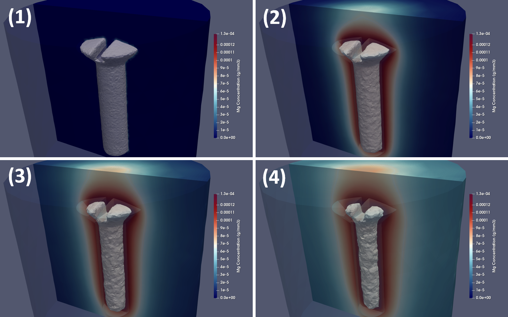
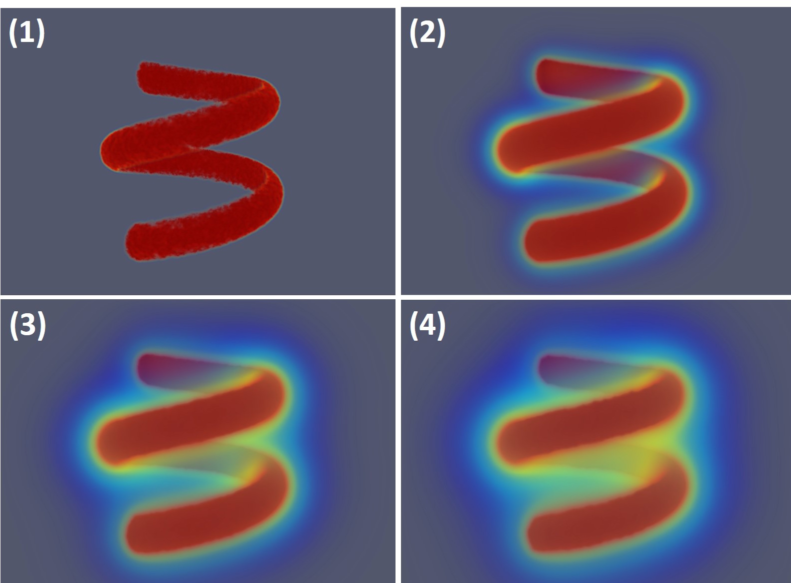
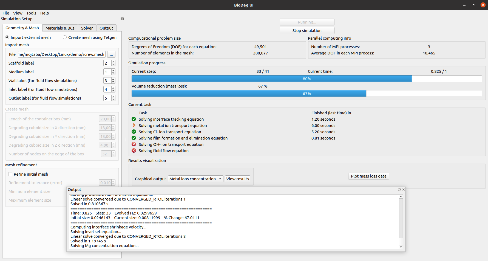

# BioDeg, biodegradation and corrosion simulation code

[](https://github.com/mbarzegary/BioDeg-UI/actions/workflows/main.yml)
[](LICENSE)
[](CONTRIBUTING.md)
<!--[](https://app.travis-ci.com/mbarzegary/BioDeg-UI)-->

## About

This repository contains the source code of BioDeg-UI, the user interface of BioDeg code for simulating the biodegradation and corrosion behavior of metallic materials. The BioDeg code (the computational core) is being maintained/developed in [this repository](https://github.com/mbarzegary/BioDeg).

BioDeg is an open-source software written in FreeFEM (a domain-specific language for finite element programming), C++, and Python for modeling the degradation of metallic biomaterials and simulating the biodegradation behavior of metallic medical devices and implants in corrosion experiments. It can handle any geometry of desire and supports parallel computing to simulate large-scale models.


<p>
<br>

<p>

The user interface, containing all the bundles for pre-processing and configuring simulations, is implemented using C++ and Qt toolkit. A front-end using Qt and a back-end in FreeFEM enable BioDeg to be cross-platform and be able to run on major operating systems including Linux, Windows, and macOS. The postprocessing of the results is carried out by the open source software ParaView, which is also a cross-platform postprocessor.


<p>

## Installation

Installing BioDeg is a straightforward procedure. You need to install a couple of prerequisites and download and run BioDeg. For advanced users, it might be necessary or more interesting to build everything from scratch to have more control over customizing features and improving performance.

### Easy installation

The simplest way to install and run BioDeg is via the pre-built binaries you can download from GitHub. The same principle applies to prerequisites, which is in this case FreeFEM only. So, following these steps will install BioDeg on your machine:

1. Install an MPI implementation on your system, which has different installation instructions depending on the operating system and the implementation you choose to use. In Windows, the simplest option is the open-source Microsoft MPI, which can be downloaded and installed from its [official website](https://www.microsoft.com/en-us/download/details.aspx?id=100593). In Linux, the best options are OpenMPI and MPICH, which can be installed by executing `sudo apt-get install openmpi-bin` or `sudo apt-get install mpich` in terminal (in Ubuntu).
2. Download FreeFEM installer for the platform you use and install it. You can find the {.exe} installer for Windows and the {.deb} installer for Linux (Ubuntu) in the [Release page of FreeFEM repository](https://github.com/FreeFem/FreeFem-sources/releases). You will find these files under the Assets section of the latest (or any other) version. Execute the download file and follow the installation procedure appearing on your screen.
3. Download BioDeg tarballs for your preferred platform (Windows or Linux) from the [Release page of this repository](https://github.com/mbarzegary/BioDeg-UI/releases). This is indeed the BioDeg UI bundle that contains the BioDeg core, the user interface, the pre-processor, and the post-processor.
4. Extract the downloaded tarball (zip) file and execute `runBioDeg.cmd` in Windows or `runBioDeg.sh` in Linux. By doing this, you see the BioDeg interface showing up on the screen.
5. For visualizing the results, ParaView should be installed on your system, which can be downloaded and installed from [the official website](https://www.paraview.org/download/) for different platforms. Moreover, Python is required for using the basic postprocessing templates provided by the Biodeg-UI, so it should be separately installed if one is interested to use that feature.

### Advanced installation (building the source code)

The main prerequisites of BioDeg are FreeFEM, PETSc, Mmg, and an MPI runtime (such as OpenMPI or MPICH). The PETSc library contains the rest of the dependencies. Since FreeFEM provides appropriate interfaces to Mmg and PETSc and includes installation scripts for building and installing them, all the requirements can be met by building/installing FreeFEM with the PETSc link enabled. The build procedure of FreeFEM can be found [here](https://doc.freefem.org/introduction/installation.html) for different platforms. A summary of the procedure is also included in the BioDeg user manual.

BioDeg UI is developed using Qt, so it should be installed on your system in order to compile BioDeg UI. You can find the installation instruction for various platforms [here](https://doc.qt.io/qt-5/gettingstarted.html).

After installing Qt and FreeFEM, clone this repository and follow one of the following scenarios to build it:

#### Build BioDeg UI using Qt Creator IDE

This is the simplest technique to build the program, and it has a similar procedure for all the supported platforms. Qt Creator is the default IDE for Qt development, so it is automatically installed along with Qt. Simply open the Qt project file `CMakeLists.txt` in Qt Creator (by executing `qtcreator CMakeLists.txt` or selecting *File->Open Project* from the IDE) and build the project (by pressing *Shift+B*).

#### Build BioDeg UI using Qt tools

Building the source files using CMake is quite simple. Navigate to the source files directory (the cloned repository) and run the following commands (this assumes that you have already added Qt `bin` directory to the `PATH` variable so that the CMake script can find Qt libraries and binaries):

```Shell
mkdir build
cd build
cmake ..
make
```

In Windows, you may need to call the correct build system installed along with Qt. For example, by assuming that you have installed the MinGW integration for Qt, the `make` command should be written as `mingw32-make`. Moreover, in this case, you need to call CMake with a suitable generator, so the `cmake` command should be replaced by something like `cmake -G "MinGW Makefiles" ..` (don't forget to insert the double dots).

After doing this, you can find the BioDeg UI executable in the build directory and run it by executing `./BioDeg-UI` in Linux or `.\BioDeg-UI.exe` in Windows.

#### Testing BioDeg

The testing module of BioDeg is developed using [Google Testing framework](https://github.com/google/googletest). The tests cover some basic and advanced evaluation of the functionality of FreeFEM installation and BioDeg-core, so running them may take several minutes to complete.

After building BioDeg using the process mentioned above, you can run the tests simply by executing the following command (in the build directory):

```Shell
make test
```
which can be `mingw32-make test` in Windows. You can review the results upon completion of all the tests. In a healthy installation of FreeFEM and BioDeg, all tests should pass successfully.

## Getting started

There are 2 ways to run BioDeg simulations: 1) using the UI to configure and execute BioDeg, or 2) running BioDeg directly from the command line and providing simulation parameters via command-line arguments. Moreover, in a hybrid approach, the UI can be used to configure and generate the command for method \#2, which can be useful when you want to configure the simulation only and run it later in another environment like on a super-computer or cluster. Please refer to "Running BioDeg" section of the BioDeg user manual to see the details of these 2 approaches.

## Documentation

A comprehensive user manual is provided for user-oriented documentation on installing the software, preparing the simulations, running the models, and postprocessing the results. This can be found in this repository [here](doc/manual/manual.pdf), which is originally maintained [in this repository](https://github.com/mbarzegary/BioDeg-doc).

Since FreeFEM does not support developer-focused technical documentation (like Doxygen), the core code is fully commented for easier contribution. Further technical details regarding the development, like the theoretical foundations of the computational models can be found in [the BioDeg theory guide](doc/theory_guide/theory_guide.pdf).

## Contribution

BioDeg is developed using a wide range of open source tools and is released under GPLv3, so unconstrained use and reuse are encouraged and welcome. The code has been initially developed as part of a PhD research project, but further contributions, either on the development of the core models or providing more supporting materials, are highly welcome. More guidelines for such contributions can be found in [CONTRIBUTING.md](CONTRIBUTING.md).

## Publications and citations

This code has been used in the following publications so far. In scientific works, where results to some extent are obtained using BioDeg, please cite the following articles:

    @article{barzegari2021computational,
          title = {Computational modeling of degradation process of biodegradable magnesium biomaterials},
          author = {Mojtaba Barzegari and Di Mei and Sviatlana V. Lamaka and Liesbet Geris},
          journal = {Corrosion Science},
          volume = {190},
          pages = {109674},
          year = {2021},
          issn = {0010-938X},
          doi = {10.1016/j.corsci.2021.109674},
    }

    @article{barzegari2021hpc,
          author = {Mojtaba Barzegari and Liesbet Geris},
          title ={Highly scalable numerical simulation of coupled reaction–diffusion systems with moving interfaces},
          journal = {The International Journal of High Performance Computing Applications},
          volume = {0},
          number = {0},
          pages = {10943420211045939},
          year = {0},
          doi = {10.1177/10943420211045939},
    }
