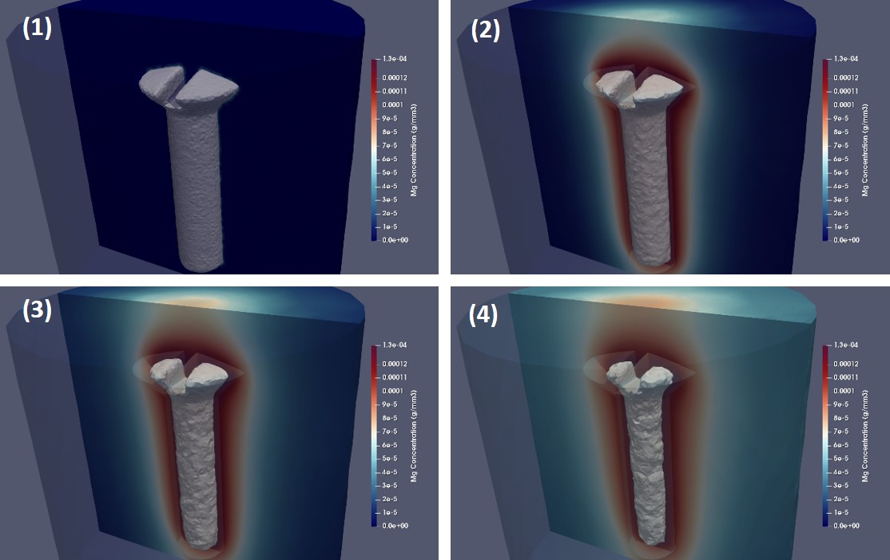

# BioDeg, a biodegradation and corrosion simulation code for metallic materials

## About

This repository contains the source code of BioDeg, a code for simulating the  biodegradation and corrosion behavior of metallic materials.

The developed model captures the release of metallic ions, changes in pH, the formation of a protective film, the dissolution of this film in presence of different ions, and the effect of perfusion of the surrounding fluid. This has been accomplished by deriving a system of time-dependent reaction-diffusion-convection partial differential equations from the underlying oxidation-reduction reactions. The level set formalism is employed to track the biodegradation interface between the material and its surroundings. The equations were solved implicitly using the finite element method for spatial terms (with a 1st order Lagrange polynomial as the shape function) and the backward-Euler finite difference method for temporal terms on an Eulerian mesh.

Tracking the moving corrosion front at the diffusion interface requires high numerical accuracy of the diffusive state variables, which is commonly achieved using a refined computational grid. This makes the model computationally intensive and in need of parallelization (the models usually have 10-20 millions of elements in 3D). The parallel algorithm is implemented using a domain decomposition method (restricted additive Schwarz). Beside this, the formed linear system of equations in each partition of the mesh is solved using Krylov methods by taking advantage of the highly-efficient preconditioners and iterative solvers of the PETSc library.

For more details about the mathematical and computational models, please refer to the published works.

## Publications and referencing

This code has been used in the following publications so far. In scientific works, where results to some extent are obtained using BioDeg, please cite the following articles:

    @article{Barzegari2021,
          title = {Computational modeling of degradation process of biodegradable magnesium biomaterials},
          author = {Mojtaba Barzegari and Di Mei and Sviatlana V. Lamaka and Liesbet Geris},
          journal = {Corrosion Science},
          volume = {190},
          pages = {109674},
          year = {2021},
          issn = {0010-938X},
          doi = {10.1016/j.corsci.2021.109674},
    }

    @article{Barzegari2022,
          author = {Mojtaba Barzegari and Liesbet Geris},
          title ={Highly scalable numerical simulation of coupled reaction–diffusion systems with moving interfaces},
          journal = {The International Journal of High Performance Computing Applications},
          volume = {36},
          number = {2},
          pages = {198-213},
          year = {2022},
          doi = {10.1177/10943420211045939},
    }

## Getting started

The code is implemented in FreeFEM, a domain-specific language for finite element computing. So, a parallel version of FreeFEM should be installed. A proper MPI runtime is required to run parallel FreeFEM (such as OpenMPI or MPICH). The PETSc module should also be installed and linked to FreeFEM (which is usually the default config for installing/compiling FreeFEM). The installation procedure can be found [here](https://doc.freefem.org/introduction/installation.html) for different platforms.

After installing the required software packages, the code can be run like this:

`$ mpirun -n 4 FreeFem++-mpi src/main.edp -v 0`

You can specify the number of employed cores (which also implies the number of mesh sub-partitions) by the `-n` switch (it is 4 in this example). The `-v 0` switch is used to suppress the verbosity of FreeFEM. The configs (such as the input mesh or the output location) can be modified in the source file `parameters.idp`.

## Changelog

#### Version 0.1 (June 2019)
* Full 3D implementation of static degradation model for Mg
* Interface tracking based on Level set equation
* Modeling the formation of a protective film and the effect of Cl ions
* Automatic 3D mesh adaptation on the interface
* Simple domain decomposition using MPI
* Using MUMPS direct parallel solver to solve algebraic equations
* Ability to adaptively refine and (basically) coarsen the mesh during simulation
* Element-wise VTK output
* Based on FreeFem++ 3.6

#### Version 0.2 (August 2019)
* Ability to import complex geometries in Eulerian mesh
* Adding an ASCII art as the title

#### Version 0.3 (November 2019)
* Adding the pH changes modeling equation to the base model
* Making the code more configurable
* Changing the ASCII art to include university of Liege
* Implementing a non-linear solver for OH equation (not released finally in the code)
* Making the MPI parallelization scheme compatible with FreeFEM 4.x

#### Version 0.4 (January 2020)
* Massively parallel code using PETSc preconditioners and iterative solvers
* Restricted additive Schwarz Domain decomposition using HPDDM
* Using METIS for mesh partitioning
* Not compatible with FreeFEM versions prior to 4.4.3!
* Changing the VTK output to node-wise format (point data instead of cell data)

#### Version 0.5 (June 2020)
* Implementing a newton solver to calculate initial interface velocity
* Mesh import improvement to include more elements for the scaffold
* Adding more parameters and configuration settings
* Ability to save the last state of the model on a non-overlapping mesh
* Changing the boundary condition of Cl and OH equations to no-flux on the interface

#### Version 0.6 (October 2020)
* Ability to export the scaffold (material block) using Mmg
* Ability to interpolate state variables on the original non-partitioned mesh
* Dramatic mesh import improvement using chi function
* Support to read preprocessed distance function (output of an external tool)
* A minor change in the mesh partitioning technique
* Saving mass loss fraction to the text output file

#### Version 0.7 (February 2021)
* Adding fluid flow equation to the core model
* Adding convection effect on the transport equations
* Ability to switch between full Navier-Stokes and Stokes equation
* Ability to turn off flow effect and equation (or adjust if it should be solved every N steps)
* Fieldsplit preconditioners for fluid flow equation

#### Version 0.8 (November 2021)
* Replacing density and viscosity with dynamic viscosity in fluid equations
* Rewriting the redistancing code to be compatible with the parallelization scheme
* Considering the porous characteristic of the film for the fluid equation
* Fixing the convection behavior on the moving corrosion interface
* Fixing the MPI buffer issue in Windows
