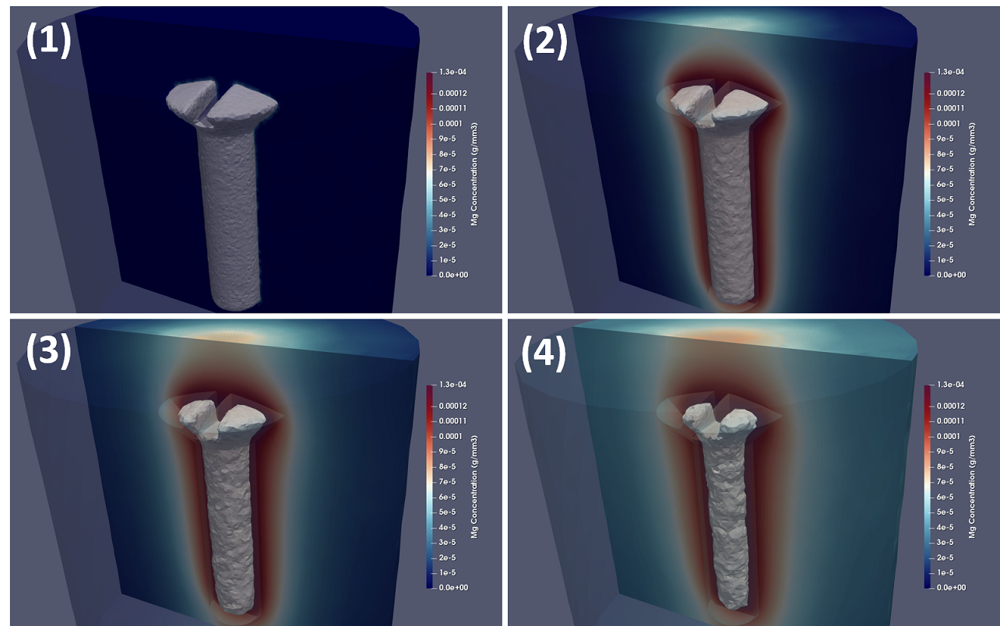

# Summary

BioDeg is an open source software written in FreeFEM (a domain-specific language for finite element programming), C++, and Python for modeling the degradation of metallic biomaterials and simulating the biodegradation behavior of medical devices, implants, and scaffolds in corrosion experiments. The underlying mathematical and computational models are already validated in the previous contributions [@barzegari2021, @barzegari2021hpc] by comparing the predictions made by the code with the experimentally obtained quantities. BioDeg supports simulating the change of morphology of the material block/implant/scaffold, release of materials, formation of surface corrosion products, the effect of the surrounding environment (such as various electrolyte solutions and chemical components as well as the presence of fluid flow), and change of other quantities (such as pH). It features command-line and graphical interfaces, being available on all major operating systems and platforms. BioDeg is designed with open standards in mind and as a result, can be easily integrated into other established workflows such as topology optimization and tissue growth models.

# Statement of need

Biomaterials, the substances we put inside the body to replace/repair a lost functionality, can be classified into two categories from a biodegradation perspective: bio-inert and biodegradable. While the former type has a few interactions with its surrounding environment, the latter gradually disappears and gets absorbed by the body [@Zheng2014, @Chen2014]. Although bio-inert biomaterials show a great performance especially in fixation applications, they bring an important problem into play: they remain in the body forever or require additional surgery to remove them. Biodegradable materials do not have this problem, and in the case of metallic biomaterials, they also provide a suitable mechanical stability profile. However, taking advantage of them requires tuning the degradation parameters and material release rate [@Zhao2017].

This problem is usually investigated by conducting *in-vitro* (in the lab) and *in-vivo* (in a living system) tests of biodegradable metallic scaffolds and implants, which requires conducting multiple experiments for different scenarios and situations and spending a lot of resources. Developing a quantitative mathematical model of the degradation process is a proper solution to this issue by allowing researchers to study the biodegradation behavior of any desired implant *in-silico* (in the computer) prior to conducting any *in-vitro* or *in-vivo* experiments. Developed mathematical models can be simulated using efficient numerical methods such as the finite element method.

Although there is a wide variety of relevant theoretical studies in the field of corrosion and biodegradation simulation [@Gastaldi2011, @Wilder2014, @Grogan2014, @Bajger2016, @Dolgikh2019, @Hoche2014, @SanzHerrera2018], to the best of the authors' knowledge, none of the developed models has been publicly released together with their code to be evaluated by the scientific community. It means that none of the previous contributions are available as a software tool for relevant users such as researchers in biomaterials science, regenerative medicine (tissue engineering), and biomedical engineering.

Moreover, the available tools used to implement aforementioned models are not open source or have the issue of restricted access. For example, COMSOL multiphysics (COMSOL Inc., USA) has a module for mechanistic corrosion simulation with a limited set of features. Another example in this regard is the MuPhyS software [@Dolgikh2019, @Christoph2021] developed by the SURF research group. Despite being able to perform mechanistic biodegradation simulations, MuPhys has a restricted access and is not publicly available to general users.

BioDeg is a fully open source biodegradation and corrosion simulation software, currently validated for magnesium biomaterials [@barzegari2021]. A cross-platform and easy-to-use user interface makes it possible for anyone to use the program to simulate the biodegradation behavior of metallic implants with any shape of interest without concerning the technical aspects of the code. Technically speaking, BioDeg uses the finite element method to solve a set of partial differential equations derived mechanistically from the chemistry of biodegradation and utilizes high-performance computing (HPC) techniques to make the computation scalable to hundreds and thousands of computational nodes.

# Overview of BioDeg

## Basic concepts

From a general point of view, material modeling techniques are categorized as either stochastic or deterministic. In stochastic modeling, material state evolution is modeled by a set of semi-random rules, implying the conditions in which materials interact with their surrounding environment. On the other hand, deterministic modeling takes advantage of conservative laws in physics, formulating the interactions of materials by means of the rules such as the ones coming from transport phenomena [@Kurtz1972].

BioDeg works based on the principles of deterministic modeling for predicting the biodegradation and corrosion of metallic materials. Several studies have demonstrated that this type of modeling has a high potential in representing the biodegradation and corrosion phenomena [@Dolgikh2019, @Bajger2016, @SanzHerrera2018]. BioDeg is built upon a mechanistic formulation of the biodegradation process [@barzegari2021]. The developed model captures the release of metallic ions, changes in pH, the formation of a protective film, the dissolution of this film in presence of different ions, and the effect of fluid flow of the surrounding solution. This has been accomplished by deriving a system of time-dependent reaction-diffusion-convection partial differential equations (PDEs) from the underlying oxidation-reduction reactions. The level set formalism [@RonaldFedkiw2002] was employed to track the biodegradation interface between the biomaterial and its surroundings, enabling the model to monitor the morphological changes of the investigated implant/device during the biodegradation process. As an example of BioDeg output, figure \ref{screw} demonstrates the simulation results of the biodegradation of an orthopedics screw, in which the white body and the color contour show the degrading shape of the screw and concentration of metallic ions as they are released over time, respectively.

## Implementation

Implementing a parallel 3D computational model of the developed mathematical framework allows studying the corrosion and biodegradation behavior of medical implants and devices *in-silico* no matter the complexity of the implant shape. This has been achieved by solving the derived system of equations using the finite element method on any arbitrary 3D mesh.

The computational model (BioDeg-core) is implemented in FreeFEM [@Hecht2012], a domain-specific language for PDE solving and finite element computations. While having a syntax almost identical to C++, FreeFEM provides rich interfaces to well-known scientific computing libraries for performing relevant tasks such as mesh generation, solving linear system of equations, various IO operations, and HPC. This fact makes FreeFEM a perfect choice for the implementation of complex mathematical models, especially for resource-demanding applications. Additionally, a general preprocessor (BioDeg-preprocessor) for embedding desired 3D shapes inside a container (the medium/electrolyte in biodegradation simulations) is implemented in FreeFEM using the ParMmg parallel mesh manipulation library [@Dapogny2014]. This helps non-technical users to perform simulations on their desired geometries. The preprocessor performs mesh refinement on the interface of the implant and the medium to increase the numerical accuracy of interface tracking.

The user interface (BioDeg-UI) is implemented using C++ and Qt toolkit. A front-end using Qt and a back-end in FreeFEM enable BioDeg to be cross-platform and be able to run on major operating systems including Linux, Windows, and macOS. The postprocessing of the results is carried out by the open source software ParaView [@Ahrens2005], which is also a cross-platform postprocessor.

## High-performance computing

Biodegradation simulations in BioDeg can become complex and resource-demanding. The reason lies within the refined mesh on the metal-electrolyte interface. This refined mesh is required to increase the accuracy of employed numerical schemes to track the moving corrosion front [@barzegari2021, @barzegari2021hpc]. This leads to an expensive computational model, and as a result, employing parallel computing and HPC techniques becomes crucial to make it possible to scale the simulations to hundreds or thousands of computational nodes and decrease the simulation execution time. To this end, a high-performance domain decomposition approach was employed to partition the mesh and distribute the workload to available computing resources [@Dolean2015]. Additionally, efficient preconditioners and solvers were used to solve the linear system of equations resulting from the finite element discretization. This was achieved by using the rich PETSc library [@petsc], which provides a collection of efficient preconditioners and solvers for solving PDEs.

## Installation

The main prerequisites of BioDeg are FreeFEM, PETSc, Mmg, and an MPI runtime (such as OpenMPI or MPICH). The PETSc library contains the rest of the dependencies. Since FreeFEM provides appropriate interfaces to Mmg and PETSc and includes installation scripts for building and installing them, all the requirements can be met by building/installing FreeFEM with the PETSc link enabled. While a set of pre-built binaries are available for download on the FreeFEM website, the user manual of BioDeg includes a section for instructing the users to build FreeFEM to achieve maximum flexibility on their systems.

The next step is to build or install the BioDeg UI, the graphical user interface of BioDeg. Stable binaries can be downloaded from the Release section of the GitHub repository for Windows and Linux, but if the user prefers to compile it from source code, the build process is straightforward as well. The prerequisites for building the UI are Qt framework and CMake, which need to be installed for the target operating system. The rest of the process is a standard CMake build routine, which can be followed from the installation instruction in the BioDeg User Manual or the GitHub repository. After building/installing BioDeg UI, the user can run it to setup and execute simulations.

In case the user does not need to work with the UI, like in HPC environments or for advanced users, the previous steps for building BioDeg-UI can be skipped, and the user can directly run the core model by executing `mpirun -n N FreeFem++-mpi BioDeg-core/main.edp -v 0` to parallelize the computation into N cores. In this way, the simulation can be configured by dozens of available command-line arguments, documented in the BioDeg User Manual.

For graphical output, the postprocessing of the simulation results is handled by ParaView, so the users should have it installed on the system. Stable binaries for various platforms can be found on the ParaView website, including portable versions which do not require installation and are ready to run immediately after download. The rest of the postprocessing process is managed by the BioDeg UI.

## Documentation

A comprehensive user manual is provided for user-oriented documentation on installing the software, preparing the simulations, running the models, and postprocessing the results. As this is being developed in a separate repository (BioDeg-doc), additional documents and supporting materials will be added eventually.

Since FreeFEM does not support developer-focused technical documentation (like Doxygen), the core code is fully commented for easier contribution. Further technical details regarding the development, like the theoretical foundations of the computational models, has been added to the BioDeg-doc repository.

## Contribution

BioDeg is developed using a wide range of open source tools and is released under GPLv3, so unconstrained use and reuse are encouraged and welcome. The code has been initially developed as part of a PhD research project, but further contributions, either on the development of the core models or providing more supporting materials, are highly welcome. More guidelines for such contributions can be found in the CONTRIBUTING.md file in the GitHub repository. Previous contributions are acknowledged in the BioDeg User Manual.

## Published works

The code has been already used in publishing 2 scientific works so far, and there are several studies ongoing to be prepared for publication. In the published works, BioDeg was employed to simulate the behavior of high-pure magnesium (HP Mg) in immersion corrosion tests [@barzegari2021] as well as to evaluate the efficiency and scalability of the employed parallelization schemes for reaction-diffusion systems with moving boundaries [@barzegari2021hpc]. Currently, the code is being used for simulating the degradation of magnesium in hydrodynamics (perfusion) conditions, in which the underlying phenomena are investigated in the presence of fluid flow. Moreover, BioDeg is being coupled with a topology optimization code for optimizing the shape of biodegradable structures for medical applications. Later, it will be integrated it with an optimization code and bone tissue growth models for improving the design process of biodegradable orthopedics implants.

# Acknowledgements

The research in which the code is developed is financially supported by the Prosperos project, funded by the Interreg VA Flanders – The Netherlands program, CCI grant no. 2014TC16RFCB046 and by the Fund for Scientific Research Flanders (FWO), grant G085018N. We also acknowledge support from the European Research Council under the European Union's Horizon 2020 research and innovation programme, ERC CoG 772418.

# References
